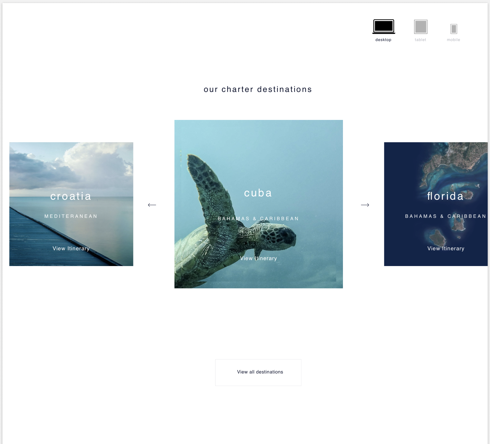
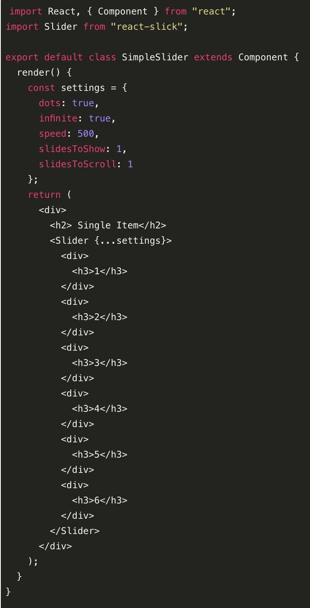
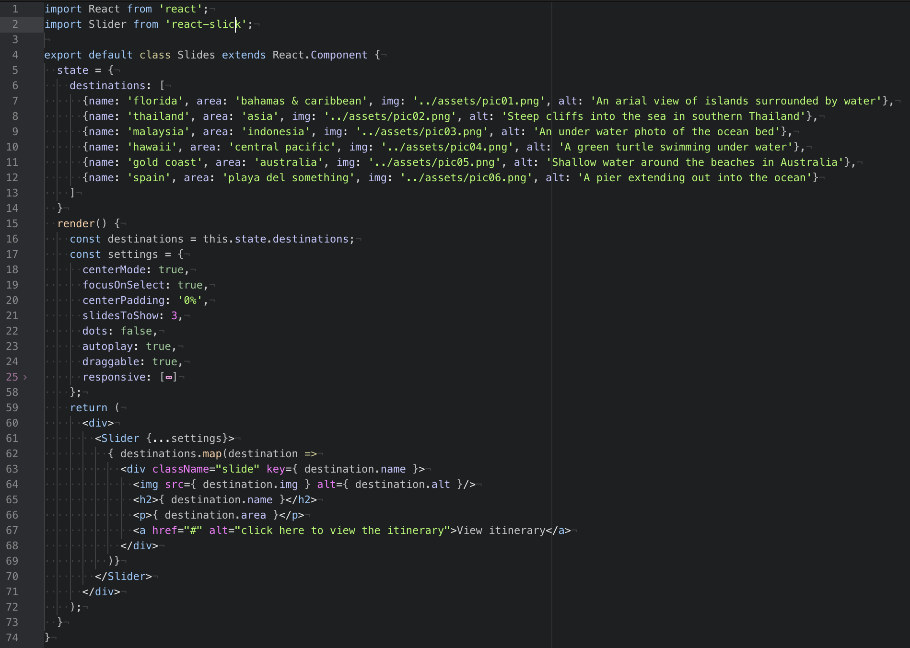

# Image Carousel

## Brief:

Build a content carousel module that is fully responsive and matches a supplied design file, using HTML, CSS and JavaScript. The carousel should respond to click, drag and swipe.

## The Design / Wireframes:

The design was supplied in 3 parts: Desktop, Tablet and Mobile.

## The Approach:

I decided to build the carousel using React, as I thought it would lend itself well to the different sections/components of the design.

After a quick google search, I discovered the React Slick and Slick Carousel dependencies, which I installed with Yarn.

I created the environment and tested with a simple "Hello World!", to make sure the content was being displayed on the screen.

From here, I broke down the component into two sections:

> - The Wrapper

The wrapper houses the title, the slider component and the link to all destinations.

> - The Slider

This section houses the slides. The text and image to create each slide is stored on state, and created dynamically in the components render function.

Lastly, I used SCSS to style the page and media queries to make the page responsive for the supplied breakpoints.

## The Result:

I managed to accurately recreate the original design, however I did make the slides to the left and right of the centre slide slightly larger, as I felt it was more visually pleasing.

## Blockers:

The build was fairly straight forward, except for getting the buttons on either side of the desktop carousel to show arrows. The CSS supplied by Slick renders the arrows transparent and I need to investigate why this wouldn't change when I set the color to black.

As a work around, I put a border around the arrows to render a box, which looks ok but with more time, I would fix this bug.

## Wins

This was my first attempt at building a carousel and I think it went ok!

I'm pleased with my adaption of the code examples on the Slick docs and the refactoring of the render function.

> - Before:

> - After:

